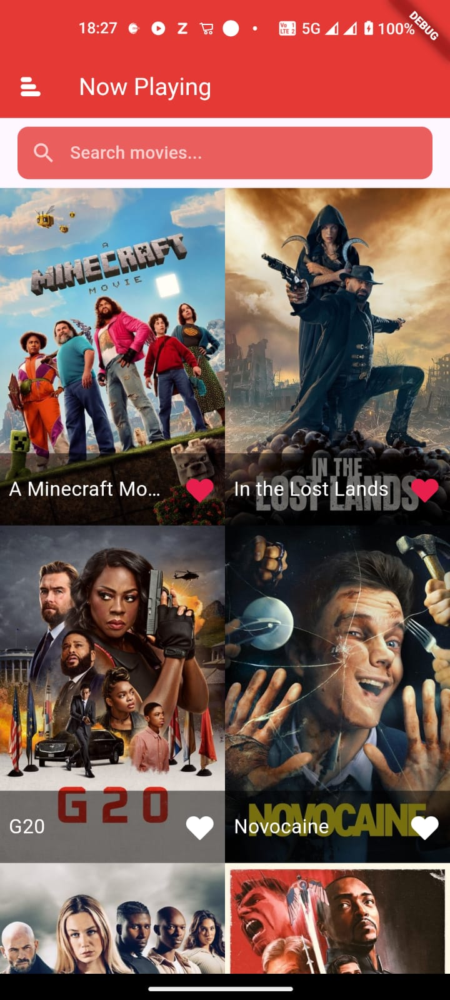

# flutter_tmdb_app

# 🎬 TMDB Movie App (Flutter)

A Flutter application that displays trending movies using the [TMDB API](https://www.themoviedb.org/). Built with clean architecture and modern Flutter .

## ⚠️ Network Issue Note

**Having trouble fetching movie data?**

Please try to **run the app using mobile data**.

In some cases, `tmdb.org` might be **blocked or filtered on certain Wi-Fi networks**, which prevents the app from accessing the TMDB API.

---

## 🚀 Features

- Fetches now playing movies from TMDB
- Displays movie posters, titles, and release info
- Clean UI built with Flutter widgets
- Async API integration using `Dio`
- offline db using Hive
- Error handling and state management (Getx)

---

## 📱 Screenshots

## Getting Started

This project is a starting point for a Flutter application.

A few resources to get you started if this is your first Flutter project:

- [Lab: Write your first Flutter app](https://docs.flutter.dev/get-started/codelab)
- [Cookbook: Useful Flutter samples](https://docs.flutter.dev/cookbook)

For help getting started with Flutter development, view the
[online documentation](https://docs.flutter.dev/), which offers tutorials,
samples, guidance on mobile development, and a full API reference.
# Stageflix-App
